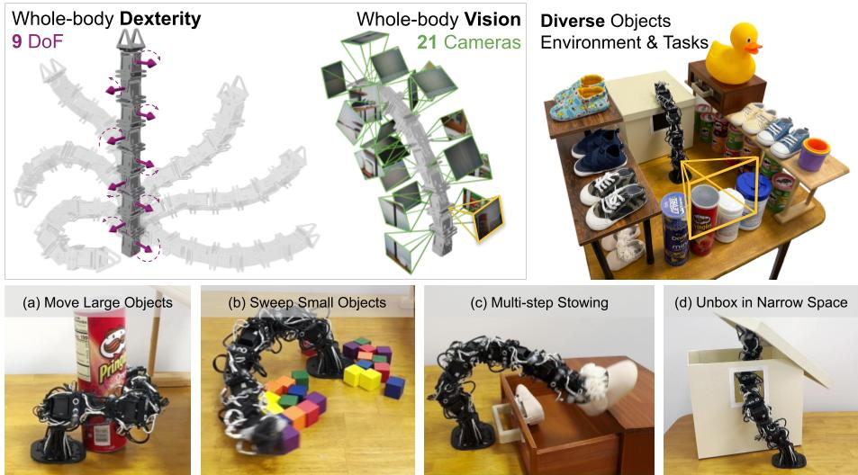

# RoboPanoptes: The All-Seeing Robot with Whole-body Dexterity
### Robotics: Science and Systems (RSS 2025)

[[Project page]](https://robopanoptes.github.io)
[[Paper]](https://arxiv.org/abs/2501.05420)
[[Hardware Guide]](https://docs.google.com/document/d/1U1PXqNg9yF4Uvd74MMpcInC5d0Mlj-Ny0KU5RxoYfP4/edit?usp=sharing)

[Xiaomeng Xu](https://xxm19.github.io/)<sup>1</sup>,
[Dominik Bauer](https://dornik.github.io/)<sup>2</sup>,
[Shuran Song](https://www.cs.columbia.edu/~shurans/)<sup>1,2</sup>

<sup>1</sup>Stanford University,
<sup>2</sup>Columbia University,



## 🛠️ Installation
```console
pip install -r requirements.txt
```

## 🚂 Training Whole-body Visuomotor Policy
Single-GPU training:
```console
python train.py --config-name=train_diffusion_transformer_snake_workspace task.dataset_path=dataset.zarr.zip
```

Multi-GPU training:
```console
accelerate launch --num_processes <ngpus> train.py --config-name=train_diffusion_transformer_snake_workspace task.dataset_path=dataset.zarr.zip
```

Downloading sweeping dataset (processed):
```console
wget https://real.stanford.edu/robopanoptes/data/zarr_datasets/sweep.zarr.zip
```

Multi-GPU training:
```console
accelerate launch --num_processes <ngpus> train.py --config-name=train_diffusion_transformer_snake_workspace task.dataset_path=sweep.zarr.zip
```

The unboxing and stowing datasets are also available at https://real.stanford.edu/robopanoptes/data/zarr_datasets/.

## 🌍 Real-world Deployment
### ⚙️ Build the robot
3D print the parts and assemble the robot according to our
[Hardware Guide](https://docs.google.com/document/d/1U1PXqNg9yF4Uvd74MMpcInC5d0Mlj-Ny0KU5RxoYfP4/edit?usp=sharing).

### 🦾 Setup dynamixel motors

#### Install dynamixel SDK
```console
pip install dynamixel_sdk
```

#### Update motor IDs
Install the [dynamixel_wizard](https://emanual.robotis.com/docs/en/software/dynamixel/dynamixel_wizard2/). By default, each motor has the ID 1. In order for multiple dynamixels to be controlled by the same U2D2 controller board, each dynamixel must have a unique ID. This process must be done one motor at a time. Connect each motor, starting from the base motor, and assign them in increasing order (0~9).
- Connect a single motor to the controller and connect the controller to the computer
- Open the dynamixel wizard
- Click scan (top left corner), this should detect the dynamixel. Connect to the motor
- Look for the ID address and change the ID to the appropriate number
- Repeat for each motor

#### Find ports of U2D2s
Find dynamixel control box port map:

```console
ls /dev/serial/by-id
```

Look for the path that starts with ```usb-FTDI_USB__-__Serial_Converter```, set the ```port``` in ```eval_real.py```.

### 📷 Setup cameras
#### Find camera paths
```console
ls /dev/v4l/by-path
```

Look for the paths that look like ```/dev/v4l/by-path/pci-0000:00:14.0-usb-0:2:1.0-video-index0```, find the corresponding id for each camera. Set the ```device_ids``` in ```eval_real.py```.

### 🧹 Rollout: reproduce the sweeping policy
Download pre-trained checkpoint.
```console
wget https://real/stanford.edu/robopanoptes/data/pretrained_models/sweep.ckpt
```

Launch eval script.
```console
python eval_real.py
```

## 🐍 Collecting Your Own Data
#### 1. Find dynamixel control box port map to distinguish leader and follower:

```console
ls /dev/serial/by-id
```

Look for the paths that start with ```usb-FTDI_USB__-__Serial_Converter```, find the corresponding ```client_port``` and ```leader_port```, and replace the args in ```teleop/run_env.py```.

#### 2. Set camera device ids:
Set the ```device_ids``` in ```teleop/run_env.py```.

#### 3. Run data collection script to teleop the robot and record demonstrations:
```console
python teleop/run_env.py
```

#### 4. Process data to zarr.zip
```console
python process_data.py
```

#### 5. You're all set to train a policy on your own data!

## 📜 Citation
```console
@article{xu2025robopanoptes,
	title={RoboPanoptes: The All-seeing Robot with Whole-body Dexterity},
	author={Xu, Xiaomeng and Bauer, Dominik and Song, Shuran},
	journal={arXiv preprint arXiv:2501.05420},
	year={2025}
}	
```

## 🏷️ License
This repository is released under the MIT license. See [LICENSE](https://github.com/real-stanford/RoboPanoptes/blob/main/LICENSE) for more details.

## 🙏 Acknowledgement
- Our diffusion policy implementation is adapted from [UMI](https://github.com/real-stanford/universal_manipulation_interface).
- Our teleoperation code and guide are adapted from [GELLO](https://github.com/wuphilipp/gello_mechanical).